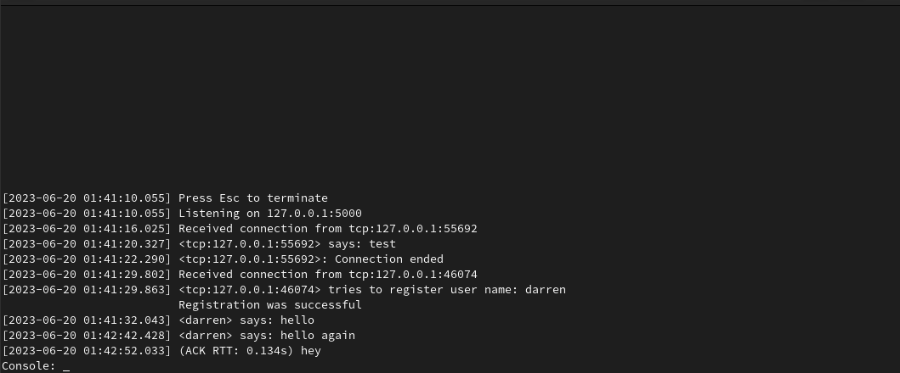
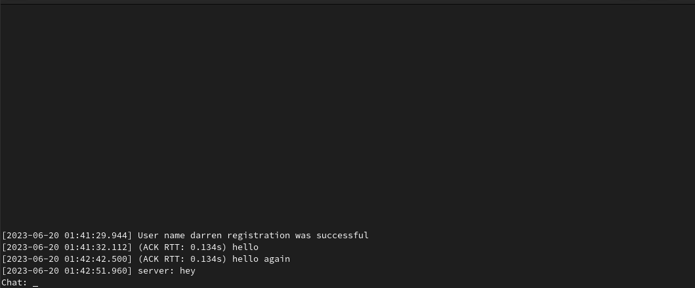
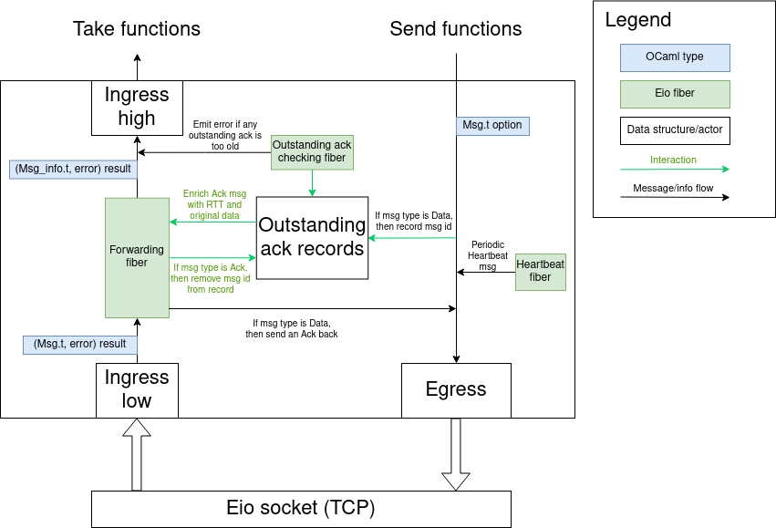
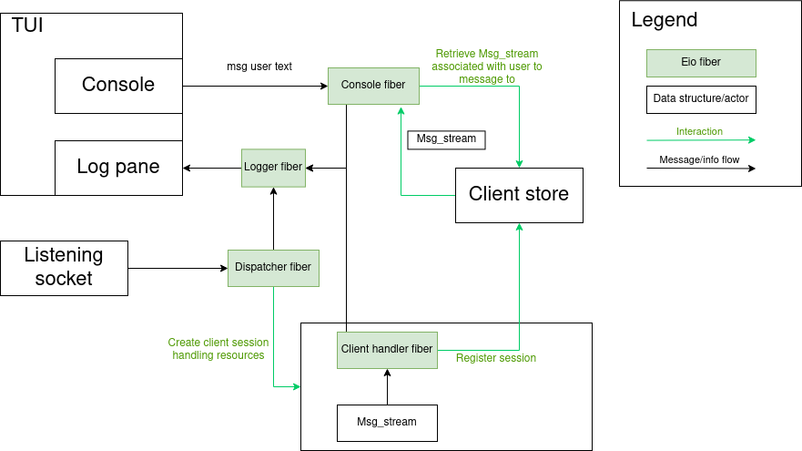
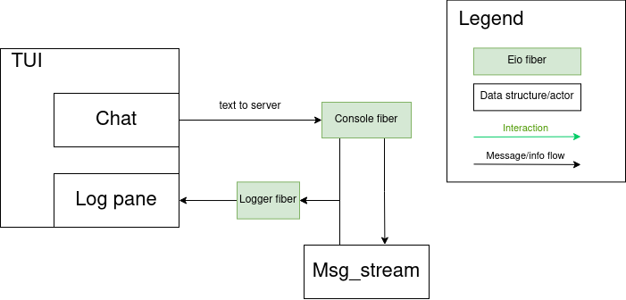

# OCaml TUI chat demo

## Installation

#### Statically linked binaries

See [releases](https://github.com/darrenldl/ocaml-tui-chat-demo/releases)

#### Build from source

Build the container image

```
podman build . -t ocaml-tui-chat
```

and run `make` once inside the container, or `make release-static` for
statically linked binaries

## Usage

`chat` operates in either `server` mode:



or `client` mode:



### Server mode

```
chat server [--host HOST] [--port PORT] [--debug]
```

`[ ... ]` denotes optional arguments

- `HOST` specifies the address to listen on, defaults to 127.0.0.1
- `PORT` specifies the port to listen on, defaults to 5000
- `--debug` enables display of debugging information on the UI

Example screenshots:

### Client mode

```
chat client [--user-name USER_NAME] [--host HOST] [--port PORT] [--debug]
```

- `--user-name USER_NAME` sends a user name registration request upon connection to server
- `HOST` specifies the address of the server to connect to, defaults to 127.0.0.1
- `PORT` specifies the port of the server to connect to, defaults to 5000
- `--debug` enables display of debugging information on the UI

Example screenshots:

## Technical details

#### Overview

`Msg_stream` is a messaging layer above Eio flow/TCP socket



Server



Client



#### Protocol and Msg_stream

Some OCaml value paths may be prefixed by `lib/` or `bin/` to
distinguish when module name is the same

(In principle they should be lifted to user facing API level for customization
should `Chat_lib` become a public library rather than an internal library)

- Format

Byte order: big-endian

```
2 bytes | message id
1 byte  | message type
4 bytes | payload length N
N bytes | payload
```

- Message types

    - `Heartbeat`
    - `Ack`
    - `Data`
    - `User_name_register`
    - `Register_fail`
    - `Register_okay`

- Idling and heartbeat

    - Connection is considered dead if no messages arrive within `Params.idle_timeout_s` (currently 5s)
    - Heartbeat fiber serves to indicate connection is still active

- Acknowledgement

    - Upon reception of message of type `Data`, a message of type `Ack` should be sent back
      to source immediately

    - A connection is considered to have an old outstanding ack if age of any outstanding ack
      is greater than `lib/Params.ack_old_threshold`

#### Server

- User name registration

    - User names are allocated on a first come, first served basis, mainly for the purpose
      of debugging
    - User name only lasts for the duration of connection
    - No connections may share a user name

- Dispatcher

    - The maximum number of concurrent clients accepted is determined by `bin/Params.concurrent_client_count`
    - This is tracked by a counting semaphore, which dispatcher tries to acquire in a loop (with a timeout to check
      for termination condition)

#### TUI

- Currently if the message cannot be rendered by Nottui (via Uutf) due to not being a valid UTF-8 encoded message,
  then a hex dump is shown instead

## Limitations

- No tests

- Text wrapping in TUI is not implemented

- Multithreading via domains is not done as Nottui/Lwd is not thread-safe, and will need to make an
  entirely new layer over it essentially.

- Nottui input field does not accept pasting of text
